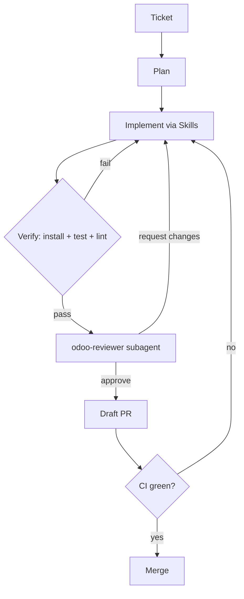

The agent follows a fixed pipeline defined in `CLAUDE.md`. It never skips the
**verify** stage — success is always proven by a real Odoo run, not asserted.

<Steps>
  <Step title="Intake & plan">
    Read the ticket. If specs are missing (model name, fields, access groups,
    target Odoo version), ask once, concisely. Produce a short task list before
    writing code.
  </Step>
  <Step title="Implement">
    Use the [Skills](/odoo-agent/skills): `odoo-scaffold-module` for a new
    module, `odoo-add-feature` to extend one, `odoo-version-port` to migrate
    between versions. Code stays consistent across model, views, and security.
  </Step>
  <Step title="Verify (never skipped)">
    Boot Odoo + Postgres and prove it works:
    ```bash
    make up                       # start odoo + postgres
    make install MODULE=<name>    # odoo-bin -i <name> --stop-after-init
    make test MODULE=<name>       # --test-enable --test-tags /<name>
    make lint                     # ruff + pylint-odoo
    ```
    If tests fail, fix and re-run. Real output is reported.
  </Step>
  <Step title="Self-review">
    Invoke the `odoo-reviewer` subagent on the diff — it checks Odoo-specific
    security, ORM, and version-compliance issues before a PR is opened.
  </Step>
  <Step title="Deliver">
    Commit on a feature branch, push, and open a **draft** PR.
  </Step>
  <Step title="Babysit">
    Subscribe to the PR; fix CI failures and answer review comments until it is
    green. The loop has a terminal state: merged or closed.
  </Step>
</Steps>

## Flow at a glance



<Tip>
  Stages 4–6 use the same GitHub + PR-webhook machinery that Claude Code on the
  web already provides, so the "full auto" loop is native — not a custom
  orchestration you have to build.
</Tip>
