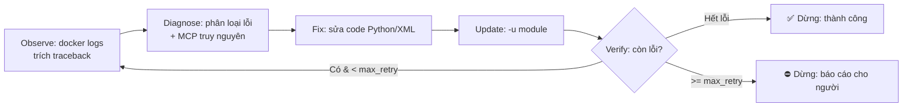

## 5.1. Triết lý: vòng lặp Observe → Diagnose → Fix → Verify

Auto-debugging hiệu quả là một **vòng lặp khép kín** có điều kiện dừng rõ ràng, không phải
"thử mù". Mỗi vòng: bắt lỗi thật từ container → để Agent đọc traceback → dùng MCP truy nguyên
nguyên nhân ở tầng schema → sửa code → cài lại module → kiểm tra. Lặp tới khi xanh hoặc chạm
giới hạn vòng (để tránh loop vô hạn / đốt token).



## 5.2. Script trích log lỗi từ container

Mấu chốt là **chỉ trích phần traceback liên quan** (không đổ toàn bộ log làm nhiễu ngữ cảnh).

`.claude/scripts/capture_odoo_error.sh`:

```bash
#!/usr/bin/env bash
# Trích traceback gần nhất từ container Odoo, kèm ngữ cảnh xung quanh.
set -euo pipefail
CONTAINER="${ODOO_CONTAINER:-odoo}"
SINCE="${1:-2m}"   # cửa sổ thời gian, mặc định 2 phút gần nhất

docker logs --since "$SINCE" "$CONTAINER" 2>&1 \
  | grep -nE "ERROR|CRITICAL|Traceback|raise |odoo\.exceptions|psycopg2|ParseError" \
  | tail -n 120 > .claude/.last_error.log

# Trích nguyên khối Traceback cuối cùng (từ 'Traceback' tới dòng exception)
docker logs --since "$SINCE" "$CONTAINER" 2>&1 \
  | awk '/Traceback \(most recent call last\)/{buf=""; cap=1}
         cap{buf=buf $0 "\n"}
         /^[A-Za-z_.]+(Error|Exception|Warning):/{if(cap){last=buf; cap=0}}
         END{printf "%s", last}' > .claude/.last_traceback.log

echo "=== Traceback đã trích ==="
cat .claude/.last_traceback.log
```

## 5.3. Bảng phân loại lỗi → hành động MCP

Cho Agent một "playbook" ánh xạ lỗi Odoo thường gặp sang bước MCP truy nguyên:

| Triệu chứng trong log | Nguyên nhân gốc thường gặp | MCP để truy nguyên |
|-----------------------|----------------------------|--------------------|
| `KeyError: 'x_field'` / `Invalid field 'x' on model` | Field không tồn tại / sai phiên bản | `get_model_fields(model)` → đối chiếu field thật |
| `ParseError ... External ID not found: module.view_x` | `inherit_id` sai | `find_view_external_id(model, type)` → lấy id đúng |
| `Element '<field name="y">' cannot be located` | Field y không có trong view cha | `get_model_fields` + `find_view_external_id` |
| `attrs ... deprecated` / view không load (v17+) | Dùng cú pháp cũ trên phiên bản mới | `inspect_odoo_version` → đổi sang cú pháp mới |
| `psycopg2 ... relation does not exist` | Model chưa tạo bảng / thiếu `-i` | `get_model_fields(model)` (nếu lỗi → model chưa cài) |
| `AccessError` / lỗi `ir.model.access` | CSV trỏ group/model ma | `generate_access_csv(model, groups)` sinh lại |

## 5.4. Prompt kịch bản Auto-debug

Lưu thành slash command `.claude/commands/odoo-autofix.md` để gọi lại nhanh:

````markdown
# /odoo-autofix

Bạn đang ở chế độ tự sửa lỗi Odoo khép kín. Tuân thủ NGHIÊM NGẶT vòng lặp dưới,
tối đa **5 vòng**. KHÔNG đoán — mọi giả thuyết phải được MCP xác nhận.

## Đầu vào
- Log lỗi: nội dung `.claude/.last_traceback.log` (chạy
  `bash .claude/scripts/capture_odoo_error.sh` để cập nhật).

## Vòng lặp (lặp tối đa 5 lần)

1. **OBSERVE** — Đọc `.last_traceback.log`. Trích: loại exception, model, field/view,
   file:line. Nếu rỗng → báo "không còn lỗi" và DỪNG (thành công).

2. **DIAGNOSE** — Phân loại theo bảng lỗi trong tài liệu auto-debugging. Với mỗi giả
   thuyết, gọi MCP tương ứng (`get_model_fields` / `find_view_external_id` /
   `inspect_odoo_version`) để XÁC NHẬN nguyên nhân. In rõ: "Nguyên nhân xác nhận: ...".

3. **FIX** — Sửa ĐÚNG file:line gây lỗi. Chỉ dùng field/id mà MCP vừa trả về. Nếu là
   lỗi quyền, sinh lại CSV bằng `generate_access_csv`.

4. **UPDATE** — Cài lại module để áp dụng:
   ```
   docker exec odoo odoo -d ci -u <module> --stop-after-init
   ```

5. **VERIFY** — Chạy lại `capture_odoo_error.sh`. Nếu traceback mới rỗng → DỪNG (thành
   công), in tóm tắt thay đổi. Nếu lỗi đổi sang lỗi khác → tiếp vòng mới. Nếu lỗi
   GIỐNG HỆT sau khi sửa → DỪNG và báo cáo (tránh loop vô ích).

## Điều kiện dừng
- ✅ Hết lỗi: tóm tắt root cause + diff đã áp dụng.
- ⛔ Hết 5 vòng hoặc lỗi lặp lại không đổi: dừng, báo cáo chi tiết cho con người,
  KHÔNG sửa liều thêm.
````

## 5.5. Tự động hóa hoàn toàn trong CI (headless)

Kết hợp với mục 1: khi CI cài module thất bại, chạy Claude Code ở chế độ headless để tự sửa
rồi push lại lên nhánh PR.

```yaml
  autofix:
    needs: build
    if: failure()
    runs-on: ubuntu-latest
    steps:
      - uses: actions/checkout@v4
        with: { ref: ai/issue-${{ github.event.issue.number }}, submodules: recursive }

      - name: Cài module & bắt lỗi
        id: install
        continue-on-error: true
        run: |
          docker compose up -d
          set +e
          docker exec odoo odoo -d ci -i my_custom_module --stop-after-init
          status=$?
          if [ $status -ne 0 ]; then
            bash .claude/scripts/capture_odoo_error.sh
            exit $status      # giữ exit code gốc → steps.install.outcome = 'failure'
          fi

      - name: Claude headless auto-fix
        if: steps.install.outcome == 'failure'
        run: |
          claude -p "/odoo-autofix" \
            --mcp-config .mcp.json \
            --permission-mode acceptEdits \
            --max-turns 30
        env:
          ANTHROPIC_API_KEY: ${{ secrets.ANTHROPIC_API_KEY }}
          ODOO_CONTAINER: odoo

      - name: Commit & push bản sửa
        run: |
          git config user.name "ai-bot"
          git config user.email "ai-bot@users.noreply.github.com"
          git add -A
          git diff --cached --quiet || git commit -m "fix: auto-debug Odoo install error"
          git push origin HEAD:ai/issue-${{ github.event.issue.number }}
```

<Warning>
**Luôn đặt trần an toàn**: `--max-turns`, số vòng tối đa, và `if: failure()` để vòng lặp có
điểm dừng. Auto-debug không giới hạn vừa đốt token vừa có rủi ro commit thay đổi sai lệch. Khi
chạm trần, hệ thống phải **chuyển sang con người** kèm chẩn đoán rõ ràng, không im lặng bỏ qua.
</Warning>

## 5.6. Mẹo tăng độ tin cậy

- **Reset DB sạch giữa các vòng nặng**: với lỗi schema (bảng đã tạo sai), đôi khi cần
  `-i` trên DB mới thay vì `-u`, vì `-u` không xóa cột cũ.
- **Phân biệt lỗi cài đặt vs lỗi runtime**: lỗi `--stop-after-init` là lỗi tải module
  (XML/manifest/field); lỗi runtime cần kịch bản tái hiện qua test.
- **Ghim traceback vào ngữ cảnh, không ghim toàn log**: log Odoo rất ồn; chỉ traceback +
  vài dòng quanh nó mới hữu ích cho Agent.
- **Liên kết ngược MCP**: sau khi sửa, gọi lại `get_model_fields` để xác nhận field mới đã
  thực sự xuất hiện sau `-u` — đóng vòng kiểm chứng.
