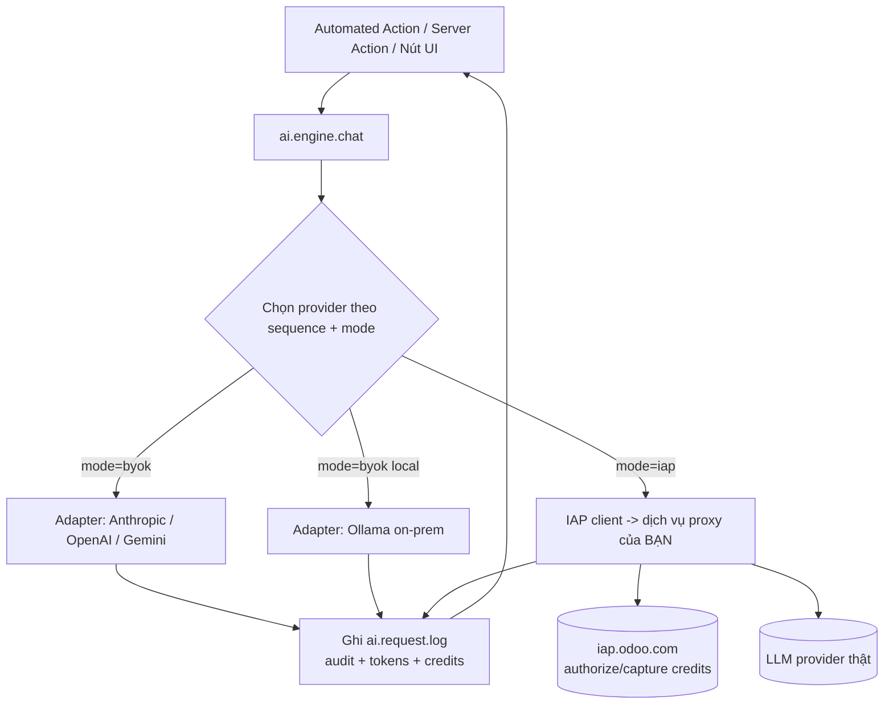

<Note>
Đây là sản phẩm "chân trời gần" rút ra từ báo cáo chiến lược: **AI là tính năng bên trong một
integration bền**, không phải sản phẩm chatbot. Phạm vi MVP: **connector đa-provider + automation
hook + audit/governance**, hai cách thu tiền **BYO-key và IAP**. RAG (pgvector) để **Phase 2**.
</Note>

## 1. Định vị: vì sao đây là integration sticky, không phải wrapper

Bằng chứng đã verify: app AI generic **churn nhanh hơn ~30%** (giữ chân năm 21,1% so với 30,7%),
và dễ bị AI native của nền tảng nuốt. Để thoát bẫy đó, sản phẩm này tạo **switching-cost** bằng 4 lớp:

| Lớp tạo độ dính | Khách xây gì lên trên → khó rời |
|---|---|
| **Provider abstraction** | Cấu hình provider + fallback chain + model mặc định |
| **Automation hook** | Các automated action / server action gọi AI gắn vào quy trình thật |
| **Audit & governance** | Log mọi lời gọi AI (ai/khi nào/tốn bao nhiêu) — đáp ứng compliance |
| **Local LLM (Ollama) + BYO-key** | Khách ngành quy định (GDPR) khoá vào vì native Odoo không có local LLM |

→ Ba lớp dưới chính là 3 gap đã xác định ở native Odoo (provider lock, không audit, không local LLM).

## 2. Kiến trúc tổng thể



## 3. Cấu trúc module

```
ai_bridge/
├── __init__.py
├── __manifest__.py
├── models/
│   ├── __init__.py
│   ├── llm_provider.py          # cấu hình provider + key + fallback
│   ├── ai_engine.py             # AbstractModel: chat(), dispatch, rate-limit, log
│   ├── ai_request_log.py        # audit/governance
│   └── res_config_settings.py   # cấu hình chung
├── security/
│   ├── ai_bridge_groups.xml     # group User / Manager
│   └── ir.model.access.csv      # sinh bằng generate_access_csv (xem PR #3)
├── views/
│   ├── llm_provider_views.xml
│   ├── ai_request_log_views.xml
│   └── res_config_settings_views.xml
├── data/
│   └── ai_bridge_data.xml       # provider mẫu + IAP service name
└── static/description/
    ├── index.html               # trang mô tả store
    └── banner.png
```

## 4. `__manifest__.py` (bản v18 — mỗi phiên bản là 1 SKU)

```python
{
    "name": "AI Bridge: Multi-Provider LLM Connector",
    "version": "18.0.1.0.0",          # tiền tố = series Odoo; bắt buộc đúng để qua review
    "category": "Productivity/AI",
    "summary": "Kết nối Odoo với Claude/OpenAI/Gemini/Ollama. BYO-key hoặc IAP. "
               "Audit đầy đủ, hỗ trợ LLM local cho GDPR.",
    "author": "Your Company",
    "website": "https://your-domain.example",
    "license": "OPL-1",               # app trả phí: dùng OPL-1; KHÔNG phụ thuộc module AGPL
    "depends": ["base", "mail", "iap"],   # iap có sẵn trong Odoo standard
    "external_dependencies": {"python": ["requests"]},  # chỉ requests → tránh lỗi cài
    "data": [
        "security/ai_bridge_groups.xml",
        "security/ir.model.access.csv",
        "data/ai_bridge_data.xml",
        "views/llm_provider_views.xml",
        "views/ai_request_log_views.xml",
        "views/res_config_settings_views.xml",
    ],
    "images": ["static/description/banner.png"],
    "price": 299.00,
    "currency": "EUR",
    "support": "support@your-domain.example",
    "installable": True,
    "application": True,
}
```

<Warning>
**Không** thêm SDK riêng (`anthropic`, `openai`) vào `external_dependencies` — nếu môi trường
khách thiếu, module **không cài được** và bị unpublish. Chỉ dùng `requests` và gọi REST trực tiếp.
</Warning>

## 5. Model lõi

### 5.1 `llm.provider` — cấu hình & fallback

```python
# models/llm_provider.py
from odoo import api, fields, models

class LLMProvider(models.Model):
    _name = "llm.provider"
    _description = "LLM Provider Configuration"
    _order = "sequence, id"

    name = fields.Char(required=True)
    provider_type = fields.Selection(
        [("anthropic", "Anthropic (Claude)"),
         ("openai", "OpenAI"),
         ("gemini", "Google Gemini"),
         ("ollama", "Ollama (local)")],
        required=True, default="anthropic",
    )
    mode = fields.Selection(
        [("byok", "Bring-your-own-key / Local"),
         ("iap", "Managed credits (IAP)")],
        required=True, default="byok",
    )
    base_url = fields.Char(help="Override endpoint; ví dụ http://localhost:11434 cho Ollama")
    model = fields.Char(required=True, default="claude-sonnet-4-6")
    api_key = fields.Char(groups="ai_bridge.group_ai_manager")  # chỉ Manager đọc được
    max_tokens = fields.Integer(default=1024)
    temperature = fields.Float(default=0.2)
    sequence = fields.Integer(default=10, help="Thứ tự fallback khi provider lỗi")
    active = fields.Boolean(default=True)
```

### 5.2 `ai.request.log` — audit/governance (điểm khác biệt)

```python
# models/ai_request_log.py
from odoo import fields, models

class AIRequestLog(models.Model):
    _name = "ai.request.log"
    _description = "AI Request Audit Log"
    _order = "create_date desc"

    provider_id = fields.Many2one("llm.provider", ondelete="set null")
    model = fields.Char()
    status = fields.Selection(
        [("success", "Success"), ("error", "Error"), ("blocked", "Blocked")],
        default="success", index=True,
    )
    source = fields.Char(help="server_action / automation / manual")
    input_tokens = fields.Integer()
    output_tokens = fields.Integer()
    credits_used = fields.Float()
    duration_ms = fields.Integer()
    error_message = fields.Char()
    prompt_fingerprint = fields.Char(help="SHA-256 của prompt — audit không lưu nội dung nhạy cảm")
    company_id = fields.Many2one("res.company", default=lambda s: s.env.company)
    # create_uid / create_date có sẵn → biết AI nào, ai gọi, khi nào
```

### 5.3 `ai.engine` — bộ điều phối (dispatch + rate-limit + log + charge)

```python
# models/ai_engine.py
import hashlib
import time
import requests
from odoo import api, models
from odoo.exceptions import UserError
from odoo.addons.iap.tools import iap_tools

IAP_ENDPOINT = "https://iap.your-domain.example"   # dịch vụ proxy do BẠN host (mục 6.2)
IAP_SERVICE_NAME = "ai_bridge"

class AIEngine(models.AbstractModel):
    _name = "ai.engine"
    _description = "AI Engine (provider dispatch + audit)"

    @api.model
    def chat(self, messages, provider=None, source="manual"):
        """messages = [{'role': 'user', 'content': '...'}]. Trả về text."""
        self._check_rate_limit()
        providers = ([provider] if provider
                     else self.env["llm.provider"].search([("active", "=", True)]))
        if not providers:
            raise UserError("Chưa cấu hình LLM provider nào.")

        last_error = None
        for prov in providers:                     # fallback chain theo sequence
            t0 = time.time()
            try:
                text, usage = self._dispatch(prov, messages)
                self._log(prov, "success", source, usage, int((time.time()-t0)*1000),
                          messages)
                return text
            except Exception as exc:               # noqa: BLE001 — log rồi thử provider kế
                last_error = exc
                self._log(prov, "error", source, {}, int((time.time()-t0)*1000),
                          messages, error=str(exc))
        raise UserError("Tất cả provider đều lỗi: %s" % last_error)

    # ---- dispatch theo loại provider -------------------------------------
    def _dispatch(self, prov, messages):
        if prov.mode == "iap":
            return self._dispatch_iap(prov, messages)
        return getattr(self, "_dispatch_%s" % prov.provider_type)(prov, messages)

    def _dispatch_anthropic(self, prov, messages):
        url = (prov.base_url or "https://api.anthropic.com") + "/v1/messages"
        r = requests.post(url, timeout=60, headers={
            "x-api-key": prov.api_key or "",
            "anthropic-version": "2023-06-01",
            "content-type": "application/json",
        }, json={
            "model": prov.model, "max_tokens": prov.max_tokens,
            "temperature": prov.temperature, "messages": messages,
        })
        r.raise_for_status()
        data = r.json()
        text = "".join(b.get("text", "") for b in data.get("content", []))
        u = data.get("usage", {})
        return text, {"in": u.get("input_tokens", 0), "out": u.get("output_tokens", 0)}

    def _dispatch_ollama(self, prov, messages):    # LLM local — cho khách GDPR
        url = (prov.base_url or "http://localhost:11434") + "/api/chat"
        r = requests.post(url, timeout=120, json={
            "model": prov.model, "messages": messages, "stream": False,
        })
        r.raise_for_status()
        data = r.json()
        return data["message"]["content"], {"in": 0, "out": 0}

    # _dispatch_openai / _dispatch_gemini: xem mục 5.4.

    def _dispatch_iap(self, prov, messages):       # managed credits (mục 6.2)
        account = self.env["iap.account"].get(IAP_SERVICE_NAME)
        result = iap_tools.iap_jsonrpc(IAP_ENDPOINT + "/api/chat", params={
            "account_token": account.account_token,
            "database_uuid": self.env["ir.config_parameter"].sudo()
                                 .get_param("database.uuid"),
            "model": prov.model, "messages": messages,
            "max_tokens": prov.max_tokens,
        })
        return result["text"], {"in": result.get("input_tokens", 0),
                                "out": result.get("output_tokens", 0),
                                "credits": result.get("credits_used", 0)}

    # ---- guardrails ------------------------------------------------------
    def _check_rate_limit(self):
        from odoo import fields as odoo_fields
        limit = int(self.env["ir.config_parameter"].sudo()
                    .get_param("ai_bridge.daily_user_limit", "200"))
        start_of_day = odoo_fields.Datetime.to_string(
            odoo_fields.Datetime.now().replace(hour=0, minute=0, second=0))
        used_today = self.env["ai.request.log"].sudo().search_count([
            ("create_uid", "=", self.env.uid),
            ("create_date", ">=", start_of_day),
        ])
        if used_today >= limit:
            raise UserError("Bạn đã đạt giới hạn %s lượt AI/ngày." % limit)

    def _log(self, prov, status, source, usage, dur, messages, error=None):
        digest = hashlib.sha256(str(messages).encode()).hexdigest()
        self.env["ai.request.log"].sudo().create({
            "provider_id": prov.id, "model": prov.model, "status": status,
            "source": source, "input_tokens": usage.get("in", 0),
            "output_tokens": usage.get("out", 0), "credits_used": usage.get("credits", 0),
            "duration_ms": dur, "error_message": error, "prompt_fingerprint": digest,
        })
```

<Tip>
`chat()` là **API nội bộ** để các automated action / server action / module khác gọi. Chính
việc khách viết automation dựa trên nó tạo nên switching-cost. Hãy tài liệu hoá nó như một
"public service" của module.
</Tip>

### 5.4 Adapter OpenAI & Gemini (đầy đủ)

```python
# Tiếp models/ai_engine.py

    def _dispatch_openai(self, prov, messages):
        url = (prov.base_url or "https://api.openai.com") + "/v1/chat/completions"
        r = requests.post(url, timeout=60, headers={
            "Authorization": "Bearer %s" % (prov.api_key or ""),
            "Content-Type": "application/json",
        }, json={
            "model": prov.model, "messages": messages,
            "max_tokens": prov.max_tokens, "temperature": prov.temperature,
        })
        r.raise_for_status()
        data = r.json()
        text = data["choices"][0]["message"]["content"]
        u = data.get("usage", {})
        return text, {"in": u.get("prompt_tokens", 0), "out": u.get("completion_tokens", 0)}

    def _dispatch_gemini(self, prov, messages):
        # Gemini dùng 'contents' + role 'user'/'model' (không có 'assistant'/'system')
        contents = []
        for m in messages:
            role = "model" if m["role"] == "assistant" else "user"
            contents.append({"role": role, "parts": [{"text": m["content"]}]})
        base = prov.base_url or "https://generativelanguage.googleapis.com"
        url = "%s/v1beta/models/%s:generateContent?key=%s" % (
            base, prov.model, prov.api_key or "")
        r = requests.post(url, timeout=60, json={
            "contents": contents,
            "generationConfig": {
                "maxOutputTokens": prov.max_tokens,
                "temperature": prov.temperature,
            },
        })
        r.raise_for_status()
        data = r.json()
        text = data["candidates"][0]["content"]["parts"][0]["text"]
        u = data.get("usageMetadata", {})
        return text, {"in": u.get("promptTokenCount", 0),
                      "out": u.get("candidatesTokenCount", 0)}
```

<Tip>
Cả 4 adapter trả về cùng tuple `(text, usage)` nên `ai.engine.chat` không cần biết provider nào
— đó chính là lớp **provider abstraction** tạo độ dính. Thêm provider mới (Mistral, DeepSeek,
OpenRouter) = thêm một `_dispatch_<type>` và một dòng selection, không đụng phần còn lại.
</Tip>

### 5.5 Ví dụ end-to-end: gắn AI vào quy trình

**Cách A — Server Action (admin tạo, không cần module mới):** dán code vào một
`ir.actions.server` (state = code), chạy được trên bất kỳ model có trường text:

```xml
<!-- data/ai_bridge_demo_action.xml -->
<odoo>
  <record id="action_ai_summarize" model="ir.actions.server">
    <field name="name">AI: Tóm tắt bản ghi</field>
    <field name="model_id" ref="base.model_res_partner"/>  <!-- ví dụ res.partner -->
    <field name="binding_model_id" ref="base.model_res_partner"/>  <!-- hiện trong menu Action -->
    <field name="state">code</field>
    <field name="code">
prompt = "Tóm tắt liên hệ này bằng 3 gạch đầu dòng:\n%s" % (record.comment or record.name)
text = env["ai.engine"].chat(
    [{"role": "user", "content": prompt}], source="server_action")
record.message_post(body=text)
    </field>
  </record>
</odoo>
```

Trong context của server action có sẵn `env`, `record`/`records`, `model` — gọi thẳng
`env["ai.engine"].chat(...)`. Khách tự tạo các action như vậy gắn vào workflow → switching-cost.

**Cách B — Companion module (khi cần nút cố định trên một app):** tách thành module phụ
`ai_bridge_crm` (`depends = ['ai_bridge', 'crm']`) để **không** ép module lõi phụ thuộc `crm`:

```python
# ai_bridge_crm/models/crm_lead.py
from odoo import models

class CrmLead(models.Model):
    _inherit = "crm.lead"

    def action_ai_summary(self):
        self.ensure_one()
        text = self.env["ai.engine"].chat(
            [{"role": "user",
              "content": "Tóm tắt cơ hội sau:\n%s" % (self.description or "")}],
            source="crm_summary")
        self.message_post(body=text)
        return text
```

<Note>
Giữ module lõi `ai_bridge` **không phụ thuộc app nghiệp vụ** (chỉ `base, mail, iap`). Mỗi tích
hợp theo app (CRM, Helpdesk, Project...) là một **companion module bán riêng** — vừa đúng luật
versioning của Odoo, vừa mở rộng dòng sản phẩm mà không phình lõi.
</Note>

## 6. Hai cách thu tiền

### 6.1 BYO-key / Local (mặc định, hợp on-prem & compliance)

Khách nhập API key của họ vào `llm.provider`, hoặc trỏ tới Ollama local. Bạn thu bằng **bán
license OPL-1** trên store (one-time theo phiên bản, hoặc gói + support). Không cần hạ tầng ngoài.

### 6.2 Managed credits qua IAP (recurring theo lượng dùng)

Khách mua **credit** từ Odoo; mỗi lời gọi trừ credit. Cần **2 phần**:

1. **Module client** (chính là `_dispatch_iap` ở trên) — đã xong.
2. **Dịch vụ proxy do BẠN host** (codebase riêng, ví dụ FastAPI): nhận request, **authorize/capture
   credit** với `https://iap.odoo.com`, rồi gọi LLM thật và trả text.

```python
# iap_service/app.py  (HẠ TẦNG RIÊNG của bạn, KHÔNG nằm trong module Odoo)
# Pseudo-flow cho endpoint /api/chat:
#   1) Nhận account_token + database_uuid + messages
#   2) authorize(token, credit=cost_estimate) tới iap.odoo.com  -> transaction_id
#   3) gọi LLM thật (Anthropic/OpenAI...) bằng KEY của BẠN
#   4) capture(transaction_id, credit=actual_cost)  (hoặc cancel nếu lỗi)
#   5) trả {"text": ..., "input_tokens": ..., "output_tokens": ..., "credits_used": ...}
```

<Info>
Odoo đóng vai **broker** giữa khách và bạn, **cắt 25%** trên mỗi giao dịch IAP. Đăng ký dịch vụ
tại iap.odoo.com và đặt `IAP_SERVICE_NAME` khớp tên đã đăng ký. Đây là cách monetize "AI theo
lượng dùng" hợp chuẩn Odoo, doanh thu recurring.
</Info>

## 7. Security & governance

`security/ir.model.access.csv` (sinh bằng `generate_access_csv` từ blueprint PR #3 — không gõ tay):

```csv
id,name,model_id:id,group_id:id,perm_read,perm_write,perm_create,perm_unlink
access_llm_provider_user,llm.provider.user,model_llm_provider,ai_bridge.group_ai_user,1,0,0,0
access_llm_provider_manager,llm.provider.manager,model_llm_provider,ai_bridge.group_ai_manager,1,1,1,1
access_ai_request_log_user,ai.request.log.user,model_ai_request_log,ai_bridge.group_ai_user,1,0,0,0
access_ai_request_log_manager,ai.request.log.manager,model_ai_request_log,ai_bridge.group_ai_manager,1,1,1,1
```

- `api_key` đặt `groups="ai_bridge.group_ai_manager"` → user thường không đọc được key.
- Rate-limit theo user/ngày (đã có trong `_check_rate_limit`).
- Audit log bất biến với user thường (chỉ read) → đáp ứng yêu cầu governance.

## 8. Chiến lược đa phiên bản (v16 → v19)

Mỗi series là **một SKU bán riêng** (luật Odoo từ v13). Dùng **nhà máy Claude Code + MCP ở PR #3**
để port và **xác minh schema thật từng phiên bản** (chống Field Blindness). Các khác biệt cần shim:

| Khác biệt | v16 | v17 | v18 | v19 |
|---|---|---|---|---|
| `attrs` / `states` trong view | Dùng được | **Bỏ** → `invisible="..."` | Bỏ | Bỏ |
| Thẻ list view | `<tree>` | `<tree>` | `<list>` | `<list>` |
| `name_get()` | OK | **Deprecated** → `_compute_display_name` | idem | idem |
| Khai báo assets | manifest `assets` | idem | idem | idem |

Quy trình port 1 phiên bản:
1. `inspect_odoo_version` → biết series + `syntax_hints`.
2. `get_model_fields` cho mọi model chạm tới (ở đây ít, vì model là của riêng module).
3. Sửa view theo bảng trên; chạy `-i ai_bridge --stop-after-init` để bắt lỗi; auto-debug (PR #3 mục 5).
4. Đổi `version` manifest, đăng SKU mới.

## 9. Go-to-market & định giá

| Gói | Mô hình | Gợi ý giá | Ghi chú |
|---|---|---|---|
| **Core (BYO-key/Local)** | License OPL-1, one-time theo phiên bản | €199–€399 | Biên cao, không vận hành hạ tầng |
| **Managed AI (IAP)** | Recurring theo token | markup trên giá token | Odoo cắt 25%; doanh thu đều |
| **Support/Update** | Phụ phí năm | 20–30% giá license | Tăng độ dính |

- License **OPL-1**; dependency phải **LGPL/đi kèm Odoo** (đừng phụ thuộc AGPL).
- Nhắm **on-prem + Odoo.sh + Community** (SaaS không cài được module Python).

### Validate TRƯỚC khi build hết (quan trọng cho solo/vốn ít)
1. Mở landing + danh sách chờ; nói chuyện 5–10 đối tác/khách Odoo có nhu cầu compliance/local-LLM.
2. Pre-sell gói Core cho 3–5 khách đầu (đặt cọc) trước khi hoàn thiện IAP.
3. Chỉ dựng hạ tầng IAP khi đã có lực kéo BYO-key.

## 10. Roadmap

- **Phase 1 (MVP — tài liệu này):** connector đa-provider + automation hook + audit + local LLM, BYO-key + IAP.
- **Phase 2 — RAG:** embeddings + pgvector trên model/field Odoo chọn lọc (tăng switching-cost mạnh).
- **Phase 3 — Agent actions có kiểm soát:** server action sinh bởi AI chạy ở **draft + duyệt**, kèm dashboard governance — đánh đúng điểm yếu "agent chỉ draft" và "thiếu audit" của native.

<Warning>
Giữ kỷ luật định vị: **AI là feature của một integration bền**. Nếu trượt về "chatbot generic",
bạn rơi lại vào vùng churn 30%/năm và rủi ro bị AI native của Odoo nuốt.
</Warning>
