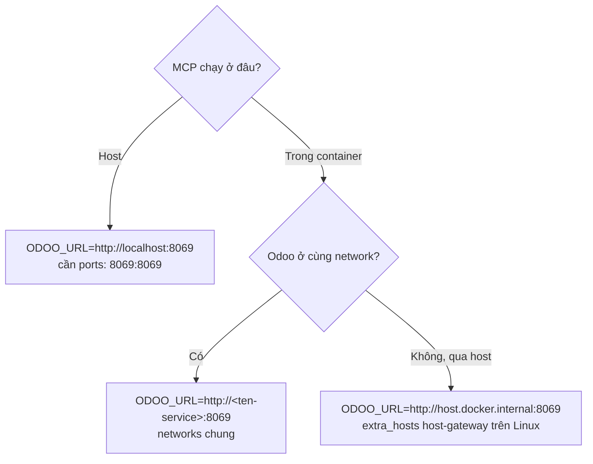

## 3.1. Hiểu đúng gốc rễ lỗi "localhost"

Lỗi kết nối phổ biến nhất xuất phát từ việc **`localhost` mang ý nghĩa khác nhau tùy nơi tiến
trình chạy**:

| Tiến trình chạy ở | `localhost` trỏ tới | Gọi Odoo container thế nào |
|-------------------|---------------------|----------------------------|
| **Host** (terminal máy bạn) | chính máy host | `http://localhost:8069` ✅ *(nếu container `-p 8069:8069`)* |
| **MCP server trong 1 container khác** | chính container đó (rỗng) ❌ | `http://host.docker.internal:8069` hoặc tên service |
| **GitHub Actions service container** | network của job | `http://localhost:8069` (service map cổng ra job) |

Nguyên tắc: **`localhost` chỉ đúng khi gọi từ chính máy/namespace đang publish cổng đó**. Khi
vượt ranh giới container, phải dùng `host.docker.internal` hoặc tên service trên cùng network.

## 3.2. Kịch bản A — Claude Code + MCP chạy ở HOST, Odoo trong Docker

Đây là setup local phổ biến nhất. MCP server là tiến trình Python ở host.

```yaml
# docker-compose.yml — Odoo + Postgres
services:
  db:
    image: postgres:16
    environment:
      POSTGRES_DB: postgres
      POSTGRES_USER: odoo
      POSTGRES_PASSWORD: odoo
    volumes: ["pgdata:/var/lib/postgresql/data"]

  odoo:
    image: odoo:18.0
    depends_on: [db]
    ports:
      - "8069:8069"          # ⭐ publish ra host → host gọi localhost:8069 OK
      - "8072:8072"          # longpolling (gevent) nếu cần
    environment:
      HOST: db
      USER: odoo
      PASSWORD: odoo
    volumes:
      - ./addons:/mnt/extra-addons   # mount repo addons để Odoo nạp module Agent sinh ra

volumes:
  pgdata:
```

Vì MCP ở host, dùng `localhost`:

```json
{ "env": { "ODOO_URL": "http://localhost:8069" } }
```

<Check>
Kiểm tra nhanh: `curl http://localhost:8069/web/database/selector` ở host phải trả HTML.
Nếu treo → cổng chưa publish hoặc Odoo chưa sẵn sàng.
</Check>

## 3.3. Kịch bản B — MCP server cũng chạy trong Docker

Khi đóng gói MCP server thành container (như `.mcp.json` ở mục 1 dùng `docker compose run`),
**không** dùng `localhost`. Có 2 cách đúng:

### B1. Cùng một Docker network (khuyến nghị — bền nhất)

Cho MCP và Odoo vào chung network rồi gọi bằng **tên service**:

```yaml
# docker-compose.mcp.yml
services:
  odoo-mcp:
    build: ./odoo_mcp
    stdin_open: true          # cần cho transport stdio của MCP
    environment:
      ODOO_URL: http://odoo:8069   # ⭐ 'odoo' = tên service, DNS nội bộ Docker tự phân giải
      ODOO_DB: ci
      ODOO_USER: admin
      ODOO_PASSWORD: ${ODOO_PASSWORD}
    networks: [odoo-net]

networks:
  odoo-net:
    external: true            # tái dùng network đã tạo bởi stack Odoo
```

Tạo network dùng chung một lần:

```bash
docker network create odoo-net
# rồi gắn cả stack Odoo lẫn MCP vào 'odoo-net' (networks: [odoo-net])
```

<Tip>
Dùng **tên service** thay vì IP. IP của container do Docker cấp động, đổi sau mỗi `up` →
hardcode IP là nguồn lỗi "sai IP" kinh điển. DNS nội bộ theo tên service thì ổn định.
</Tip>

### B2. Gọi ngược về Host qua `host.docker.internal`

Nếu Odoo publish cổng ra host và bạn muốn MCP-trong-container gọi qua host:

```yaml
services:
  odoo-mcp:
    build: ./odoo_mcp
    environment:
      ODOO_URL: http://host.docker.internal:8069
    extra_hosts:
      - "host.docker.internal:host-gateway"   # ⭐ BẮT BUỘC trên Linux
```

`host.docker.internal` có sẵn trên Docker Desktop (Mac/Windows) nhưng **trên Linux phải khai
báo `host-gateway`** như trên, nếu không sẽ lỗi "Name or service not known".

## 3.4. Kịch bản C — GitHub Actions

Trong Actions, `services:` được map cổng ra network của job, nên từ step (chạy trên runner)
gọi `http://localhost:8069` là đúng (xem mục 1.3). Nếu chạy Claude trong một container step
riêng, dùng `--network` chung hoặc service name.

## 3.5. Bảng quyết định nhanh



## 3.6. Checklist chống lỗi nghẽn / sai IP

- **Healthcheck trước khi gọi**: chờ Odoo sẵn sàng, tránh "connection refused" lúc khởi động.

  ```bash
  until curl -sf http://${ODOO_HOST:-localhost}:8069/web/health >/dev/null; do
    echo "Đợi Odoo..."; sleep 2;
  done
  ```

- **Không dùng `network_mode: host` cho Odoo trên Mac/Windows** — chỉ hoạt động trên Linux và
  phá vỡ DNS theo service name.
- **Timeout XML-RPC**: với DB lớn, `fields_get` có thể chậm. Đặt timeout transport hợp lý
  trong `ServerProxy` (qua một `Transport` tùy biến) để tránh treo phiên Agent.
- **Firewall/Proxy doanh nghiệp**: nếu Odoo sau reverse proxy HTTPS, dùng `https://` và đảm
  bảo chứng chỉ hợp lệ; XML-RPC qua proxy cần cho phép path `/xmlrpc/2/*`.
