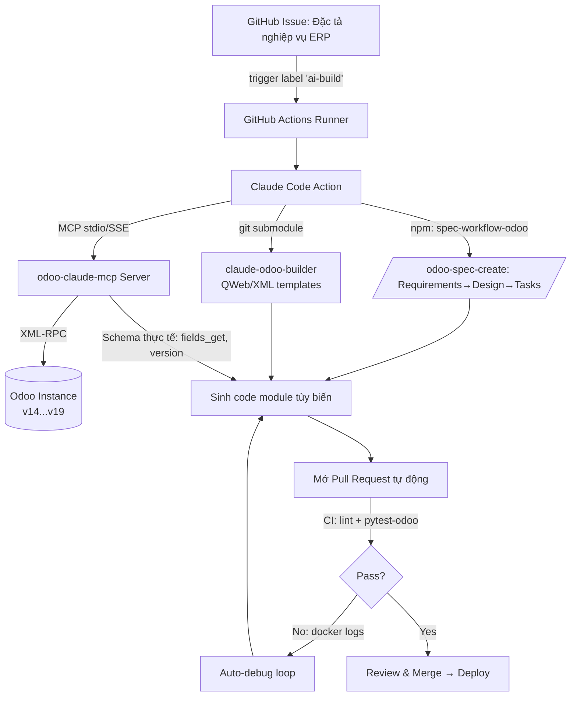

## Vấn đề cốt lõi: "Field Blindness" và sự phụ thuộc dữ liệu tĩnh

Một LLM được huấn luyện trên dữ liệu tĩnh sẽ luôn có xu hướng "bịa" tên field, tên model,
hoặc cú pháp view theo phiên bản Odoo mà nó "nhớ rõ nhất" (thường là v14–v16). Khi bạn
yêu cầu nó viết code cho Odoo 17/18/19, nó sẽ:

- Dùng field đã bị xóa/đổi tên (ví dụ `attrs`/`states` bị loại bỏ trong view từ Odoo 17).
- Giả định field tồn tại trên model trong khi thực tế nó nằm ở module khác chưa cài.
- Sinh `ir.model.access.csv` trỏ tới group hoặc model không tồn tại.

Đây là hiện tượng **Field Blindness**. Giải pháp không phải là "prompt khéo hơn", mà là
**bắt buộc Agent khảo sát Schema thực tế trước khi viết code** thông qua một kênh dữ liệu động.

<Note>
Nguyên tắc kiến trúc xuyên suốt tài liệu này: **Schema thực tế từ Odoo instance là nguồn
sự thật duy nhất (single source of truth)**, không phải bộ nhớ của LLM. Mọi dòng code Python
hay XML đều phải được "neo" (grounded) vào dữ liệu mà MCP trả về tại thời điểm chạy.
</Note>

## Ba trụ cột và vai trò trong kiến trúc

| Repo | Vai trò | Cách tích hợp đề xuất |
|------|---------|----------------------|
| [`stanleykao72/claude-code-spec-workflow-odoo`](https://github.com/stanleykao72/claude-code-spec-workflow-odoo) | Quy trình: Đặc tả → Thiết kế → Task → Code → Verify (slash command `/odoo-spec-create`, `/odoo-bug-fix`...) | Cài như **npm dev-tool** (không vendor mã nguồn), chạy `odoo-setup` để scaffold `.claude/` |
| [`rosenvladimirov/odoo-claude-mcp`](https://github.com/rosenvladimirov/odoo-claude-mcp) | MCP server kết nối Claude ↔ Odoo 15→19 (đọc/ghi, kiểm tra Schema động) | Chạy như **service độc lập** (Docker), khai báo trong `.mcp.json` |
| [`19prince/claude-odoo-builder`](https://github.com/19prince/claude-odoo-builder) | Script Python + template QWeb/XML để dựng View/Website | Vendor qua **git submodule** vào `.claude/skills/` |

<Warning>
Tên repo MCP chính xác là `rosenvladimirov/odoo-claude-mcp` (URL `odoo-claude-claude-mcp`
trả về 404). Trong các ví dụ dưới đây dùng tên đúng này.
</Warning>

## Sơ đồ luồng dữ liệu

## Các mục giải pháp

<CardGroup cols={2}>
  <Card title="1. Cấu trúc GitHub & CI/CD" href="/odoo-ai-agent/github-cicd" icon="github">
    Monorepo vs Submodule vs npm/pip, phân quyền GitHub App, và YAML Actions sinh PR từ Issue.
  </Card>
  <Card title="2. MCP Server độc lập phiên bản" href="/odoo-ai-agent/mcp-server" icon="server">
    Mã nguồn Python MCP với `inspect_odoo_version`, `get_model_fields`, `find_view_external_id`, sinh `ir.model.access.csv`.
  </Card>
  <Card title="3. Docker Networking" href="/odoo-ai-agent/docker-networking" icon="docker">
    Host ↔ Container, `host.docker.internal`, bridge vs host network, tránh lỗi localhost.
  </Card>
  <Card title="4. CLAUDE.md nghiêm ngặt" href="/odoo-ai-agent/claude-md" icon="file-shield">
    Ép Agent gọi MCP khảo sát Schema trước khi viết code (chống Field Blindness).
  </Card>
  <Card title="5. Auto-debugging" href="/odoo-ai-agent/auto-debugging" icon="bug">
    Bắt log lỗi container → MCP truy nguyên → tự sửa code không cần can thiệp.
  </Card>
</CardGroup>
